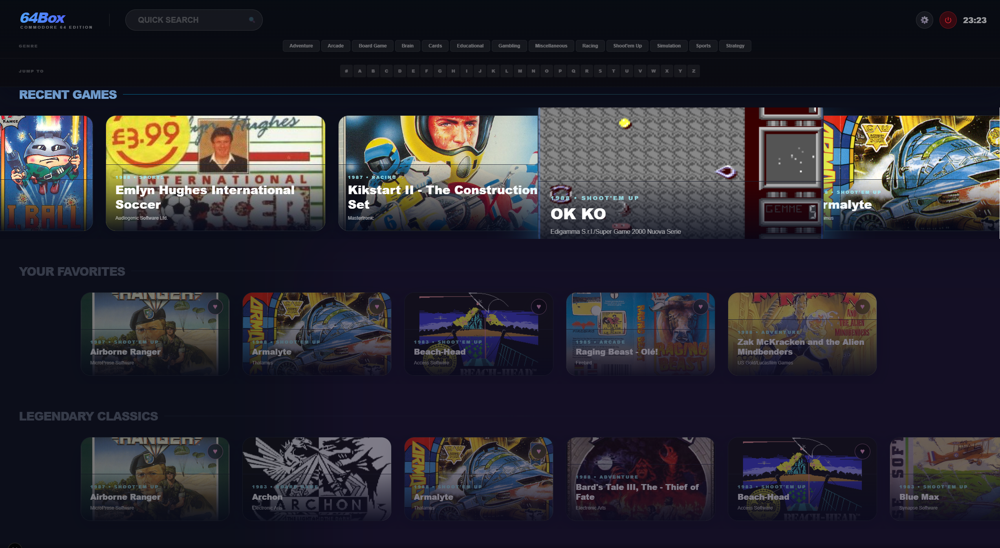
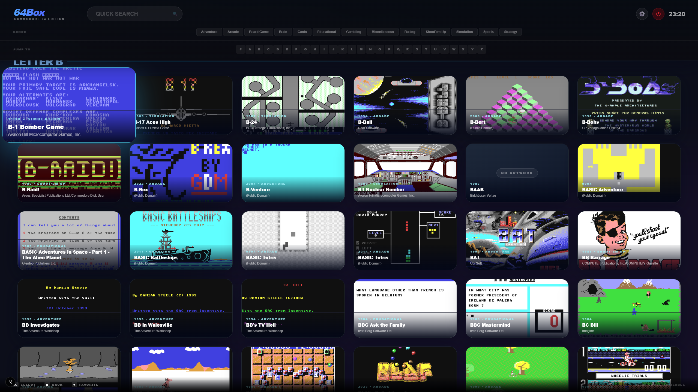
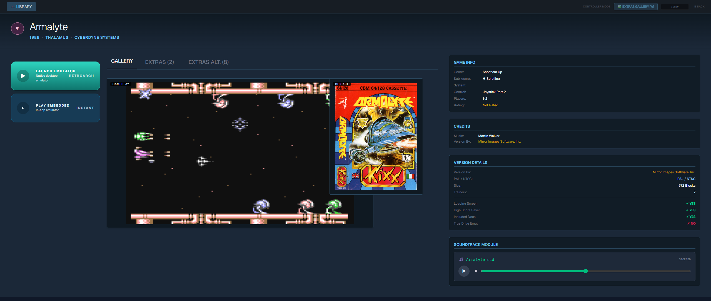
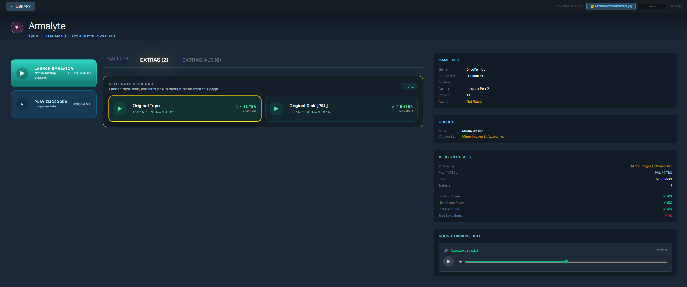
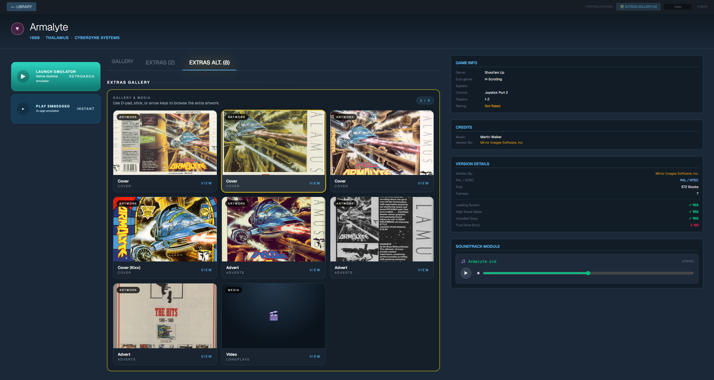

# 64Box

A cross-platform (Windows, Mac, Linux) modern frontend for the **GameBase64** Commodore 64 game database. 

> This project is a frontend for the GB64 Collection, the long-running Commodore 64 database project maintained by the GB64 Team. To learn more about the original project, visit [gb64.com](https://gb64.com/).  
> `gb64.com ©1997-2022 The GB64 Team`

## Features
- **Modern Next.js Frontend**: Fluid, gallery-style layouts mimicking modern gaming libraries. Fully responsive and supports Gamepad/Keyboard navigation.
- **Deep Metadata Browsing**: Integrated search by year, publisher, musician, and smart genres, powered by a fast local SQLite database.
- **WASM Browser Emulation**: Play games directly inside the app using an offline-bundled EmulatorJS core without any external configuration.
- **Native Emulator Bridge**: Connect to an external `x64sc` (VICE) or **RetroArch** installation for high-accuracy native desktop emulation.
- **Smart Multi-Disk Handling**: Automatically unzips games on-the-fly and generates `.vfl` (VICE) or `.m3u` (RetroArch) playlists for multi-disk games to ensure seamless booting.
- **Categorized Extras Gallery**: Integrated support for the **GameBase64 Extras** collection. Automatically groups Adverts, Books, Maps, and Manuals into a premium gallery view, while allowing alternate game versions (Disks/Tapes) to be launched directly.
- **SID Support**: Native `.sid` chiptune playback directly within the game galleries.

## Screenshots

### BigBox Search


### BigBox Rails


### BigBox Letter Jump


### Detail View: Gallery


### Detail View: Extras


### Detail View: Extras Gallery


## Controls and Shortcuts

### Controller
- **Library / Grid / List**: `D-pad` or `Left Stick` moves focus, `A` opens the focused game, `B` goes back or closes the current panel, `X` toggles Grid/List view, `Y` toggles favorite on the focused game, `LB` / `RB` jump by letter, and `Start` opens Settings.
- **BigBox**: `D-pad` or `Left Stick` moves through header rows, rails, and tiles, `A` activates the focused item, `B` goes back or exits the search field, `Y` toggles favorite on the focused game, `LB` / `RB` move between sections, and `Start` opens Settings.
- **Single Game Detail View**: `D-pad` or `Left Stick` moves between play buttons, gallery items, tabs, SID player, and favorite button, `A` activates the focused item, `B` goes back, `Y` toggles favorite, and `LB` / `RB` switch tabs or media sections.
- **Settings**: `D-pad` or `Left Stick` navigates, `A` selects, `LB` / `RB` switch settings tabs, and `B` or `Start` saves and closes.

### Keyboard
- **Library / Grid / List**: `Arrow keys` move focus, `Enter` opens the focused game, `F` toggles favorite, `Shift+F` opens Filters, `V` toggles Grid/List view, `S` opens Settings, `PageUp` / `PageDown` jump by letter, and `Alt+Enter` toggles fullscreen.
- **BigBox**: `Arrow keys` navigate header rows, rails, and tiles, `Enter` activates the focused item, `F` toggles favorite, and `Esc` exits the search box or, when pressed twice quickly, exits the app.
- **Single Game Detail View**: `Arrow keys` navigate, `Enter` or `Space` activates the focused item, `F` toggles favorite, `Tab` / `Shift+Tab` or `PageUp` / `PageDown` or `[` / `]` switch tabs, and `Esc` or `Backspace` goes back.
- **Settings**: `Arrow keys` navigate, `Enter` selects, and `Esc` saves and closes.

### Notes
- In the single game view, if fullscreen media is open, `B`, `Esc`, or `Backspace` closes the fullscreen viewer before returning to the previous screen.
- In the library view, bumper and page-based letter jumps clear the active text search and switch back to alphabet browsing.

## 1. Prerequisites

You'll need the following installed to build and run this project:
- [Node.js](https://nodejs.org/en) (v20+)
- [Rust](https://rustup.rs/) (for Tauri backend)
- **Linux (Ubuntu/Debian) System Dependencies**:
  ```bash
  sudo apt update
  sudo apt install libwebkit2gtk-4.1-dev build-essential curl wget libssl-dev libgtk-3-dev libayatana-appindicator3-dev librsvg2-dev mdbtools
  ```
- [Tauri CLI Requirements](https://tauri.app/2/guides/getting-started/prerequisites/linux/)

## 2. Setting up the Database and Assets

Because of copyright and sheer size, the GameBase64 database (`.mdb`) and its media files (`.zip`s containing screenshots, box art, game files) are **not** included with this repository.

1. **Download GameBase 64**: Go to the [GameBase64 website](http://www.gamebase64.com/) and download the core `GBC_v19.mdb` file. Place it in the root of this project.
2. **Download Media and Games**: You will need to obtain the GameBase64 collections (Games, Screenshots, BoxArt, Sid, Video) which are easily searchable online.
3. Extract the collections to your preferred location on your PC (you configure their paths later inside the app).

## 3. Building the SQLite Database

This application utilizes a highly optimized SQLite database (`gb64.sqlite`) generated from the original Access (`.mdb`) file. The conversion scripts are included.

### For Windows:
Ensure you have the Microsoft Access Database Engine / Access ODBC components installed. Microsoft provides the official download here:
- [Microsoft Access Database Engine 2016 Redistributable](https://www.microsoft.com/en-us/download/details.aspx?id=54920)

Microsoft notes on that page that support ended on **October 14, 2025**, but it remains the official download source for the MDB export tooling used here.
```bash
# This uses the Windows ODBC driver to export the MDB to CSV, then to SQLite
.\scripts\import_gb64.bat
```

### For Linux/Mac:
Ensure you have the system prerequisites installed (section 1).

You also need to install the required Node.js dependencies for the conversion script:
```bash
npm install csv-parse better-sqlite3
```

Then run the following commands to export and convert the database:
```bash
# Export MDB to CSV
./scripts/mdb-export-all.sh ./GBC_v19.mdb

# Convert CSV to SQLite
node ./scripts/convert_csv_to_sqlite.js
```

This will produce `gb64.sqlite` in the project root.

The conversion step also creates the SQLite performance indexes, the persisted `GameCoverIndex` lookup table, and the `GameSearchIndex` FTS5 full-text search table used by the app for faster browsing and metadata search. If you open an older database with a newer build of the app, the Tauri backend will create any missing support objects automatically on startup.

## 4. Running the Application in Development

```bash
# Install NPM dependencies
npm install

# Run the Tauri application (which also automatically launches the Next dev server)
# For Windows:
.\tauri-dev.bat

# For Linux/Mac:
npm run tauri dev
```
.\tauri-dev.bat
## 5. Building for Production

To build a standalone executable/installer for your operating system:

```bash
# For Windows:
.\tauri-build.bat

# For Linux/Mac:
npm run tauri build
```
You can find the compiled installers and executables in `src-tauri/target/release/bundle/`.

## 5a. Release Build Strategy

- **Windows release builds** are intended to be created locally on a Windows machine with `.\tauri-build.bat`. This avoids spending extra GitHub Actions minutes on the Windows job.
- **Linux and macOS release builds** are created by GitHub Actions when you push a version tag like `v0.4.0`.
- If you want a Windows build from GitHub Actions anyway, run the `Release Bundles` workflow manually and enable the `build_windows` input.


## Post-Setup Configuration
Once the app boots successfully, open the **Settings** menu via the top header bar:
1. Ensure the paths to your extracted GameBase64 `Screenshots`, `Games`, `BoxArt`, `Video` and `Sid` folders are set correctly.
2. Under **Local Paths**, select your preferred emulator (VICE or RetroArch).
3. If using **VICE**, point to your `x64sc.exe` executable. 
4. If using **RetroArch**, point to your `retroarch.exe` **and** select a C64 core (e.g., `vice_x64sc_libretro.dll`) from your cores directory.
5. **Extras Collection**: Point this to your unzipped GameBase64 Extras folder. The app will automatically scan and categorize items like "Adverts", "Maps", "Tips", and "Carts" (alternate game versions).

Note: The application handles temporary extraction of zipped games and creates the necessary playlist files (`.vfl` or `.m3u`) automatically before launching. Images in the Extras folder are displayed in a high-resolution lightbox, while PDFs and docs are opened via your system's default viewer.

## 6. Skills used to build this
```bash
npx skills add https://github.com/vercel-labs/agent-skills --skill web-design-guidelines
npx skills add https://github.com/vercel-labs/agent-skills --skill vercel-react-native-skills
npx skills add https://github.com/vercel-labs/agent-skills --skill vercel-react-best-practices
npx skills add https://github.com/vercel-labs/agent-skills --skill vercel-composition-patterns
npx skills add https://github.com/vercel-labs/agent-skills --skill deploy-to-vercel
npx skills add https://github.com/bitxeno/sqlite-data-skill --skill 'SQLiteData Usage Guide'
npx skills add https://github.com/apollographql/skills --skill rust-best-practices
```

Skills I created
```bash
.agents/skills/gb64-metadata-parser
.agents/skills/rom-scanner-hashing
.agents/skills/wasm-c64-bridge
.agents/skills/tauri-architecture
```
